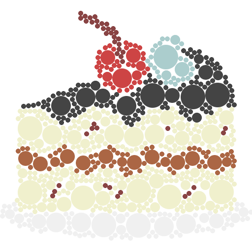

# tiler

A Go port of https://github.com/nuno-faria/tiler.

## Examples

See the [gallery](./gallery)

Tiled version of the [cake image](https://www.flaticon.com/free-icon/cake_1102780)
by [pongsakornred](https://www.flaticon.com/authors/pongsakornred)
from [FLATICON](https://www.flaticon.com).



## Usage

As a command line tool:

```bash
$ go install github.com/posener/tiler/cmd/tiler
$ tiler -h
Usage of tiler:
  -colors string
    	Scale tiles colors.
    	Use a number 'n' to define number of scales of each color component.
    	Use comma separated numbers 'r,g,b' to have different number of scales to each color component.
  -img string
    	Image to tile. Required.
  -out string
    	Destination path.
  -overlap
    	Can tiles overlap each other.
  -rotate string
    	Rotate tiles. Comma separated list of rotations in range [0..1].
  -scale string
    	Scale tiles. Comma separated list of scale factors.
  -shift string
    	Grid shifts in the format: 'x,y'. If omitted, tile size will be used.
  -tiles string
    	Path to tiles directory or a tile file. Required.
```

Or as a library: [godoc](https://godoc.org/github.com/posener/tiler).